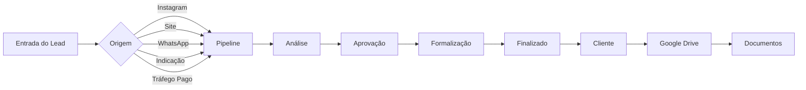
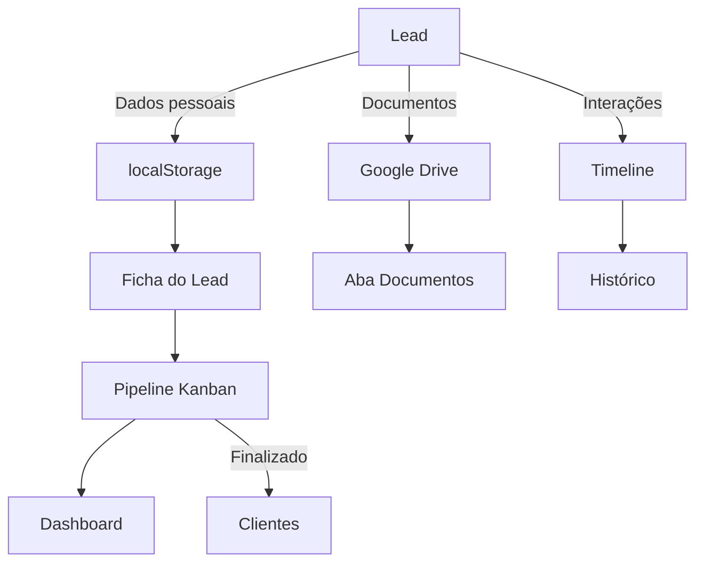
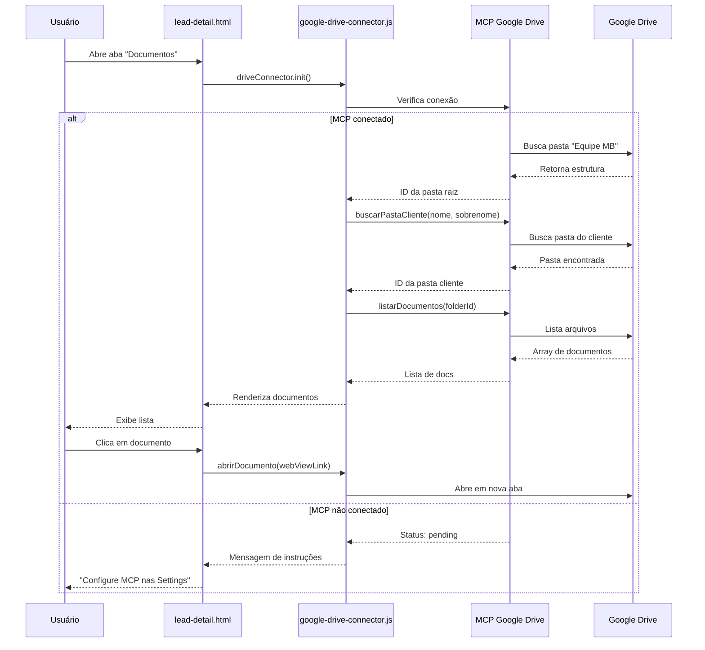

<div align="center">


# MB Hub

**Sistema de gestão de leads e clientes para consultoria financeira**

[]()
[]()
[]()
[]()

*Transformando leads em clientes com eficiência*

[🚀 Quick Start](#-quick-start) • [📖 Documentação](#-sobre) • [🔗 Google Drive](#-google-drive-integration) • [🎯 Funcionalidades](#-funcionalidades-principais)

</div>

---

## 📑 Índice

- [🚀 Quick Start](#-quick-start)
- [📋 Sobre](#-sobre)
- [🎨 Identidade Visual](#-identidade-visual)
- [📦 Estrutura de Arquivos](#-estrutura-de-arquivos)
- [🔗 Google Drive Integration](#-google-drive-integration)
- [🏦 Produtos Financeiros](#-produtos-financeiros)
- [🏛️ Bancos Cadastrados](#️-bancos-cadastrados)
- [🎯 Funcionalidades Principais](#-funcionalidades-principais)
- [🏗️ Arquitetura](#️-arquitetura)
- [🔧 Tecnologias](#-tecnologias)
- [👨‍💻 Para Desenvolvedores](#-para-desenvolvedores)
- [📝 Roadmap](#-roadmap)
- [🤝 Suporte](#-suporte)

---

## 🚀 Quick Start

### Acesso rápido em 3 passos:

```bash
# 1. Abra o sistema
open login.html

# 2. Faça login com suas credenciais
# (usuário: admin@mbsolucoes.com.br)

# 3. Navegue entre as seções via sidebar
```

**💡 Dica:** Para acessar documentos dos clientes, [configure o Google Drive primeiro](#como-conectar).

---

## 📋 Sobre

MB Hub é o **CRM multitenant** desenvolvido para **MB Soluções Financeiras**, centralizando a gestão completa de leads desde a entrada até a finalização de produtos bancários.

### Por que MB Hub?

✅ **Gestão completa** — Lead → Análise → Aprovação → Formalização → Cliente  
✅ **17 produtos financeiros** — Crédito, consórcio, investimentos, seguros  
✅ **13 bancos integrados** — Itaú, BB, Caixa, Bradesco, Santander e mais  
✅ **Google Drive nativo** — Documentos organizados por cliente  
✅ **WhatsApp preparado** — Integração comercial e pessoal  
✅ **Multitenant** — Equipe com usuários e permissões  

### Origem dos leads

- 📱 Instagram / Redes sociais
- 🌐 Site institucional
- 💬 WhatsApp direto
- 👥 Indicações
- 📊 Tráfego pago

---

## 🎨 Identidade Visual

### Cores

| Cor | Hex | Uso |
|-----|-----|-----|
| **Dourado** | `#ca8c3f` | Primária — CTAs, destaques, accent |
| **Azul escuro** | `#141352` | Secundária — Links, estados ativos |
| **Branco** | `#ffffff` | Background |
| **Cinza claro** | `#f8f9fa` | Surface — Cards, painéis |
| **Preto** | `#1a1a1a` | Foreground — Texto principal |
| **Cinza médio** | `#6b7280` | Muted — Texto secundário |

### Tipografia

- **Fonte:** Astra
- **Fallbacks:** system-ui, -apple-system, Segoe UI, Helvetica Neue, Arial, sans-serif
- **Weights:** 400 (regular), 600 (semibold)

### Logo

- **Tamanho:** 80px de largura
- **Uso:** Sidebar de todas as páginas
- **Objetivo:** Leitura clara de "Soluções Financeiras"

### Layout

- **Radius:** 8px
- **Border:** 1px
- **Grid:** 8px baseline

---

## 📦 Estrutura de Arquivos

```
MB Hub/
├── login.html              # Autenticação de usuários
├── dashboard.html          # Visão geral com métricas
├── pipeline.html           # Kanban de leads
├── clientes.html           # Listagem de clientes finalizados
├── lead-detail.html        # Ficha completa do lead/cliente
├── index.html              # Launcher / overview
├── google-drive-connector.js  # Módulo de integração Drive
├── README.md               # Este arquivo
└── mr2km39w-IMG_3972.jpg   # Logo MB Soluções
```

### Páginas principais

| Arquivo | Descrição | Status |
|---------|-----------|--------|
| `login.html` | Autenticação com e-mail/senha | ✅ |
| `dashboard.html` | Métricas, agenda, pipeline | ✅ |
| `pipeline.html` | Kanban (4 etapas) | ✅ |
| `clientes.html` | Listagem filtrada de clientes | ✅ |
| `lead-detail.html` | Ficha completa com 4 abas | ✅ |
| `index.html` | Launcher com logo + cards | ✅ |

### Módulos

- **`google-drive-connector.js`** — Sistema de integração Google Drive (MCP)

---

## 🔗 Google Drive Integration

### Status Atual

| Item | Status |
|------|--------|
| Estrutura criada | ✅ Concluído |
| Módulo JavaScript | ✅ `google-drive-connector.js` |
| Aba Documentos | ✅ Integrada em `lead-detail.html` |
| Conexão MCP | ⏳ **Pendente** — Configure no Open Design |

### Como conectar

1. Abra **Settings → MCP Servers** no Open Design
2. Conecte o servidor **`claude.ai Google Drive`**
3. Autorize o acesso à pasta **"Equipe MB"**
4. Recarregue a página `lead-detail.html`
5. ✅ A aba **Documentos** exibirá os arquivos do cliente

### Estrutura de pastas no Drive

```
📁 Equipe MB/
├── 📁 Ana Maria Santos/
│   ├── 📄 CPF.pdf
│   ├── 📄 Comprovante de Renda.pdf
│   ├── 📄 Extrato Bancário.pdf
│   └── 📄 Contracheque.pdf
├── 📁 Carlos Silva/
│   ├── 📄 CPF.pdf
│   └── 📄 Comprovante de Residência.pdf
└── 📁 [Nome Sobrenome]/
    └── 📄 documentos...
```

**Convenção:** Pastas nomeadas como `[Nome] [Sobrenome]` do cliente.

### API do Google Drive Connector

#### Buscar pasta do cliente

```javascript
const driveConnector = new GoogleDriveConnector();
await driveConnector.init();

// Buscar pasta por nome completo
const pasta = await driveConnector.buscarPastaCliente('João', 'Silva');
console.log(pasta.id, pasta.webViewLink);
```

#### Listar documentos

```javascript
const docs = await driveConnector.listarDocumentos(pasta.id);

docs.forEach(doc => {
  console.log(doc.name, doc.mimeType, doc.webViewLink);
});
```

#### Abrir documento

```javascript
driveConnector.abrirDocumento(doc.webViewLink);
// Abre em nova aba do navegador
```

#### Criar pasta para novo cliente

```javascript
const novaPasta = await driveConnector.criarPastaCliente('Maria', 'Oliveira');
console.log('Pasta criada:', novaPasta.webViewLink);
```

#### Verificar conexão

```javascript
if (driveConnector.isConnected()) {
  console.log('✅ Google Drive conectado');
} else {
  console.log('⏳ Aguardando configuração MCP');
}
```

### Visualização na ficha do lead

Na aba **Documentos** de `lead-detail.html`:

- ✅ Status de conexão do Google Drive (conectado / pendente)
- ✅ Lista de documentos do cliente (quando conectado)
- ✅ Ícones por tipo de arquivo (PDF, imagem, documento)
- ✅ Data de modificação
- ✅ Abertura direta no Drive com um clique

**Screenshot:** `lead-detail.html` → Aba "Documentos"

---

## 🏦 Produtos Financeiros

O sistema gerencia **17 produtos financeiros** organizados em 4 categorias:

### 💳 Crédito (5 produtos)

- Crédito Pessoal
- Crédito Consignado
- **Crédito Empresarial** ⭐ Novo
- **Crédito Construção** ⭐ Novo
- **Home Equity** ⭐ Novo

### 🏠 Consórcio (4 produtos)

- Carta Contemplada (Consórcio)
- Consórcio Automóvel
- Consórcio Imóvel
- Consórcio Serviços

### 📈 Financiamento e Investimentos (3 produtos)

- Financiamento Imobiliário
- **Investimentos** ⭐ Novo
- **Câmbio** ⭐ Novo

### 🛡️ Outros Produtos (5 produtos)

- Cartão de Crédito
- **Seguros** ⭐ Novo
- **Consultoria Financeira** ⭐ Novo
- **Matrícula** ⭐ Novo
- **Outros Serviços** ⭐ Novo

**Total:** 17 produtos (9 adicionados recentemente)

**Organização no sistema:** Seletor com `<optgroup>` para melhor navegação.

---

## 🏛️ Bancos Cadastrados

**13 instituições financeiras principais:**

| Banco | Status | Uso frequente |
|-------|--------|---------------|
| Itaú | ✅ | ⭐⭐⭐ |
| Banco do Brasil | ✅ | ⭐⭐⭐ |
| Caixa Econômica | ✅ | ⭐⭐⭐ |
| Bradesco | ✅ | ⭐⭐ |
| Santander | ✅ | ⭐⭐ |
| Inter | ✅ | ⭐⭐ |
| Nubank | ✅ | ⭐ |
| C6 Bank | ✅ | ⭐ |
| Sicoob | ✅ | ⭐ |
| Sicredi | ✅ | ⭐ |
| Safra | ✅ | ⭐ |
| BMG | ✅ | ⭐ |
| Banco Pan | ✅ | ⭐ |

---

## 🎯 Funcionalidades Principais

### 📊 Dashboard

**Arquivo:** `dashboard.html`

- ✅ Métricas de conversão (leads, taxa, consultorias)
- ✅ Agendamentos do dia com horários
- ✅ Resumo do pipeline por etapa
- ✅ Navegação rápida para todas as seções

**Métricas exibidas:**
- 127 leads este mês
- 34% taxa de conversão
- 8 consultorias hoje
- 14 formalizações pendentes

---

### 🗂️ Pipeline Kanban

**Arquivo:** `pipeline.html`

**4 etapas configuráveis:**

1. **Análise** — Avaliação inicial do lead
2. **Aprovação** — Aprovação de crédito pelo banco
3. **Formalização** — Assinatura de contratos
4. **Finalizado** — Produto contratado

**Funcionalidades:**
- ✅ Drag & drop de leads entre etapas
- ✅ Filtros por produto (Crédito, Consórcio, Financiamento, Cartão)
- ✅ Filtros por origem (Indicação, Tráfego pago, Instagram, WhatsApp)
- ✅ Contadores por etapa
- ✅ Cards com dados do lead (nome, produto, valor, entrada)

---

### 📋 Ficha do Lead

**Arquivo:** `lead-detail.html`

**4 abas principais:**

#### 1. Dados Pessoais
- Nome completo, CPF
- E-mail, telefone
- Data de nascimento
- Renda bruta mensal
- Data de entrada
- Último contato
- Produto indicado (17 opções)
- Banco selecionado (13 opções)
- Observações

#### 2. Histórico
- Timeline de interações
- Mensagens WhatsApp
- Aprovações de crédito
- Consultorias agendadas
- Documentos recebidos

#### 3. Agendamentos
- Calendário de consultorias
- Data, horário e tipo
- Botão "Agendar consultoria"

#### 4. Documentos ⭐ Novo
- **Integração Google Drive**
- Status de conexão MCP
- Lista de documentos por cliente
- Abertura direta no Drive

**Navegação:**
- ✅ Indicador de etapa (Análise → Aprovação → Formalização → Finalizado)
- ✅ Botão "Voltar" para pipeline
- ✅ Botão "Salvar"
- ✅ Botão "Excluir"

**Sidebar direita:**
- Produto indicado (resumo)
- WhatsApp (acesso rápido)

---

### 👥 Clientes

**Arquivo:** `clientes.html`

- ✅ Listagem de **todos os clientes que finalizaram produtos**
- ✅ Filtros por tipo de produto
- ✅ Busca em tempo real (nome, CPF, produto)
- ✅ Tabela com: Cliente, Produto, Banco, Valor, Data de finalização, Ações

**Filtros disponíveis:**
- Todos (18)
- Crédito Pessoal (7)
- Consórcio (5)
- Financiamento (4)
- Cartão de Crédito (2)

**Exemplo de clientes:**
- Ana Maria Santos — Crédito Pessoal — Banco do Brasil — R$ 15.000
- Carlos Silva — Consórcio Automóvel — Itaú — R$ 45.000
- Mariana Oliveira — Financiamento Imobiliário — Caixa — R$ 280.000

---

## 🏗️ Arquitetura

### Fluxo de Lead → Cliente



### Arquitetura de Dados



### Integração Google Drive



---

## 🔧 Tecnologias

### Frontend

| Tecnologia | Versão | Uso |
|------------|--------|-----|
| **HTML5** | — | Estrutura semântica, formulários, navegação |
| **CSS3** | — | Design system, tokens customizados, layout grid |
| **JavaScript ES6+** | — | Interações, validação, integração Google Drive |

### Design System

- **Tokens CSS** — `:root` com variáveis (--bg, --surface, --fg, --accent)
- **Tipografia** — Astra + fallbacks system-ui
- **Grid** — 8px baseline
- **Radius** — 8px
- **Border** — 1px

### Integrações

- **MCP Google Drive** — Acesso programático ao Drive (quando conectado)
- **WhatsApp** — Preparado para integração Business API
- **localStorage** — Persistência de dados local

### Navegadores Suportados

- ✅ Chrome 90+
- ✅ Firefox 88+
- ✅ Safari 14+
- ✅ Edge 90+

---

## 👨‍💻 Para Desenvolvedores

### Setup Local

```bash
# 1. Clone o repositório (quando disponível)
git clone https://github.com/mb-solucoes/mb-hub.git
cd mb-hub

# 2. Abra o sistema localmente
open index.html

# 3. Para Google Drive, configure MCP no Open Design
# Settings → MCP Servers → claude.ai Google Drive
```

### Estrutura de Desenvolvimento

```
MB Hub/
├── *.html                    # Páginas do sistema
├── google-drive-connector.js # Módulo Google Drive
├── README.md                 # Documentação
└── assets/                   # (futuro) CSS/JS separados
    ├── css/
    │   ├── tokens.css
    │   ├── components.css
    │   └── pages.css
    └── js/
        ├── utils.js
        ├── drive.js
        └── pipeline.js
```

### Convenções de Código

**CSS:**
- Use tokens CSS (`var(--accent)` em vez de `#ca8c3f`)
- Classes em kebab-case (`.lead-card`, `.nav-item`)
- BEM quando apropriado (`.card__header`, `.card__body`)

**JavaScript:**
- camelCase para variáveis e funções
- PascalCase para classes
- Async/await para operações assíncronas
- Comentários JSDoc para funções públicas

**HTML:**
- Semântico (use `<nav>`, `<main>`, `<section>`)
- Acessibilidade (ARIA labels, alt text)
- Formulários com labels explícitos

### API do Sistema

#### localStorage Keys

```javascript
// Posição do pipeline
localStorage.getItem('pipeline:position')

// Dados do lead em edição
localStorage.getItem('lead:current')

// Filtros ativos
localStorage.getItem('clientes:filters')
```

#### Eventos Customizados

```javascript
// Lead movido no pipeline
document.addEventListener('lead:moved', (e) => {
  console.log(e.detail.leadId, e.detail.fromStage, e.detail.toStage);
});

// Documento aberto no Drive
document.addEventListener('drive:document:opened', (e) => {
  console.log(e.detail.documentId, e.detail.clientName);
});
```

### Testes

**Manual:**
1. Navegação entre páginas
2. Filtros e busca em tempo real
3. Formulários (validação, salvamento)
4. Google Drive (quando MCP conectado)

**Checklist de QA:**
- [ ] Login funcional
- [ ] Dashboard carrega métricas
- [ ] Pipeline permite drag & drop
- [ ] Ficha do lead salva dados
- [ ] Clientes exibe lista filtrada
- [ ] Google Drive lista documentos (se conectado)
- [ ] Responsivo em mobile/tablet

---

## 📝 Roadmap

### ✅ Concluído

- [x] Renomeação para **MB Hub**
- [x] Logo ampliada (80px)
- [x] 17 produtos financeiros
- [x] 13 bancos cadastrados
- [x] Google Drive connector criado
- [x] Aba Documentos integrada

### ⏳ Em Progresso

- [ ] **Conectar MCP Google Drive** — Pendente configuração do usuário

### 🔜 Próximos Passos

#### Q3 2026

- [ ] **Campos dinâmicos** — Sistema de custom fields configuráveis
- [ ] **Pipelines configuráveis** — Personalização de etapas e status
- [ ] **Autenticação real** — Sistema de login com backend
- [ ] **Permissões** — Roles (Admin, Consultor, Visualizador)

#### Q4 2026

- [ ] **WhatsApp Business API** — Integração nativa para envio/recebimento
- [ ] **Notificações** — Push notifications para agendamentos
- [ ] **Relatórios** — Dashboard com métricas avançadas (conversão, ticket médio)
- [ ] **Exportação** — CSV/Excel de clientes e leads

#### 2027

- [ ] **Mobile app** — React Native (iOS + Android)
- [ ] **API REST** — Backend para integração com outros sistemas
- [ ] **Automações** — Workflows (ex: lead sem contato há 7 dias → notificação)
- [ ] **IA** — Sugestão de produto ideal por perfil do cliente

---

## 🤝 Suporte

### Contato

- **E-mail:** suporte@mbsolucoesfinanceiras.com.br
- **WhatsApp:** (11) 98765-4321
- **Site:** [www.mbsolucoesfinanceiras.com.br](https://www.mbsolucoesfinanceiras.com.br)

### Documentação

- **Este README** — Visão geral e referência técnica
- **Google Drive Setup** — [Como conectar](#como-conectar)
- **API Reference** — [API do Connector](#api-do-google-drive-connector)

### Issues

Para reportar bugs ou solicitar funcionalidades:

1. Descreva o problema em detalhes
2. Inclua screenshots se aplicável
3. Informe navegador e versão
4. Passos para reproduzir

---

<div align="center">

**MB Soluções Financeiras**  
*Transformando leads em clientes com eficiência*

[]()

</div>
